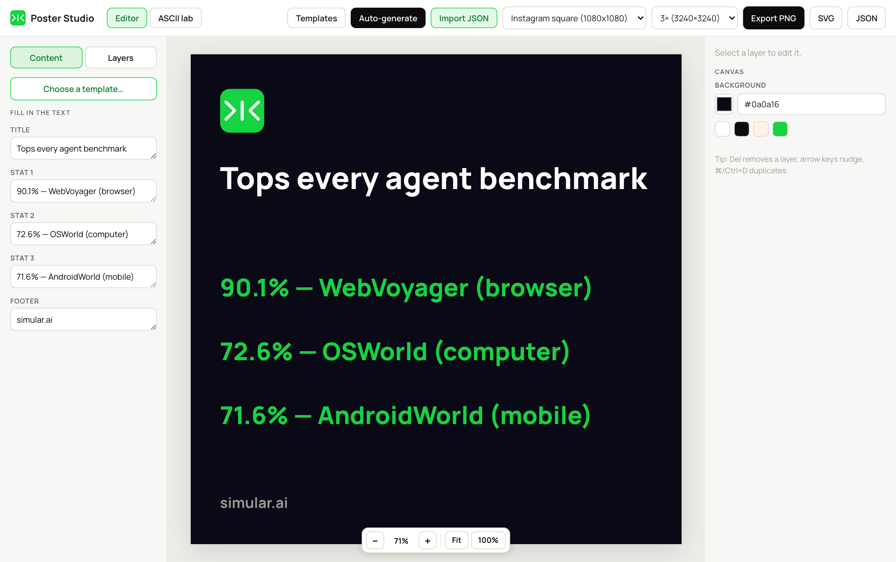
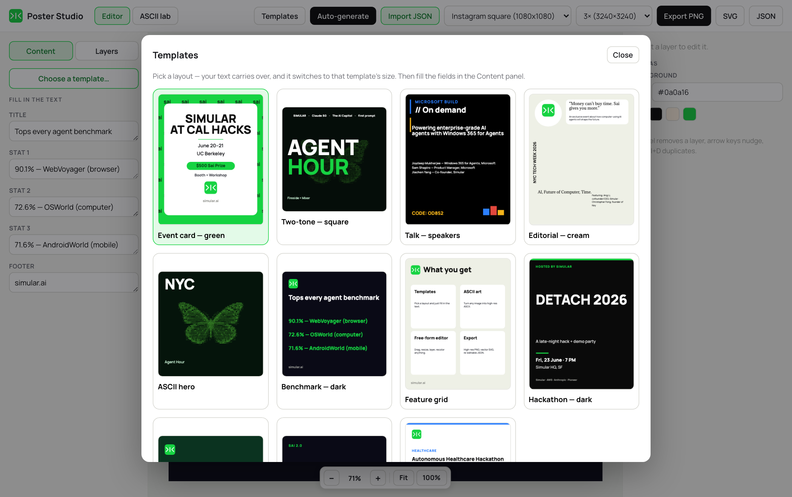
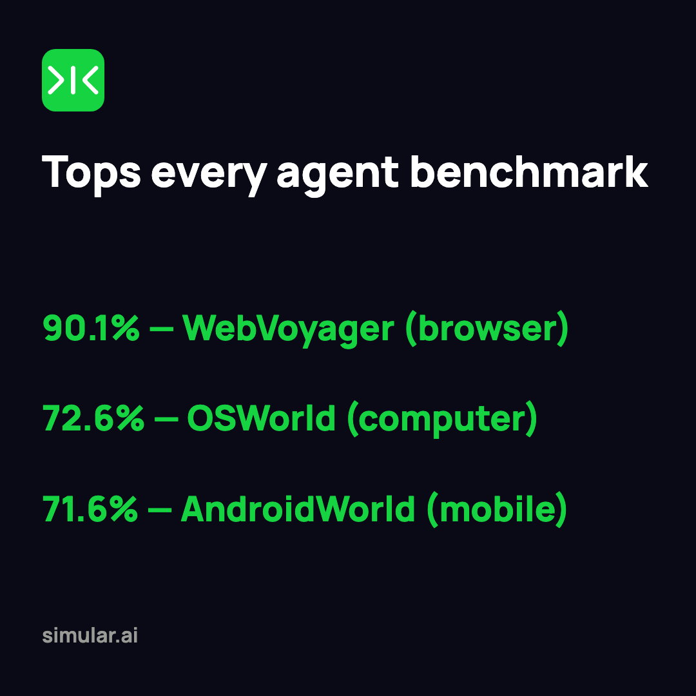
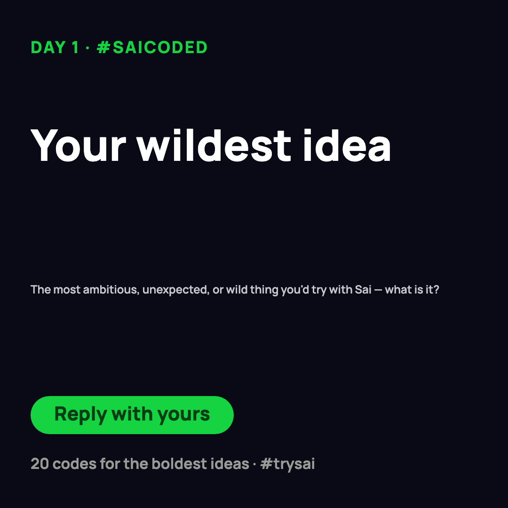
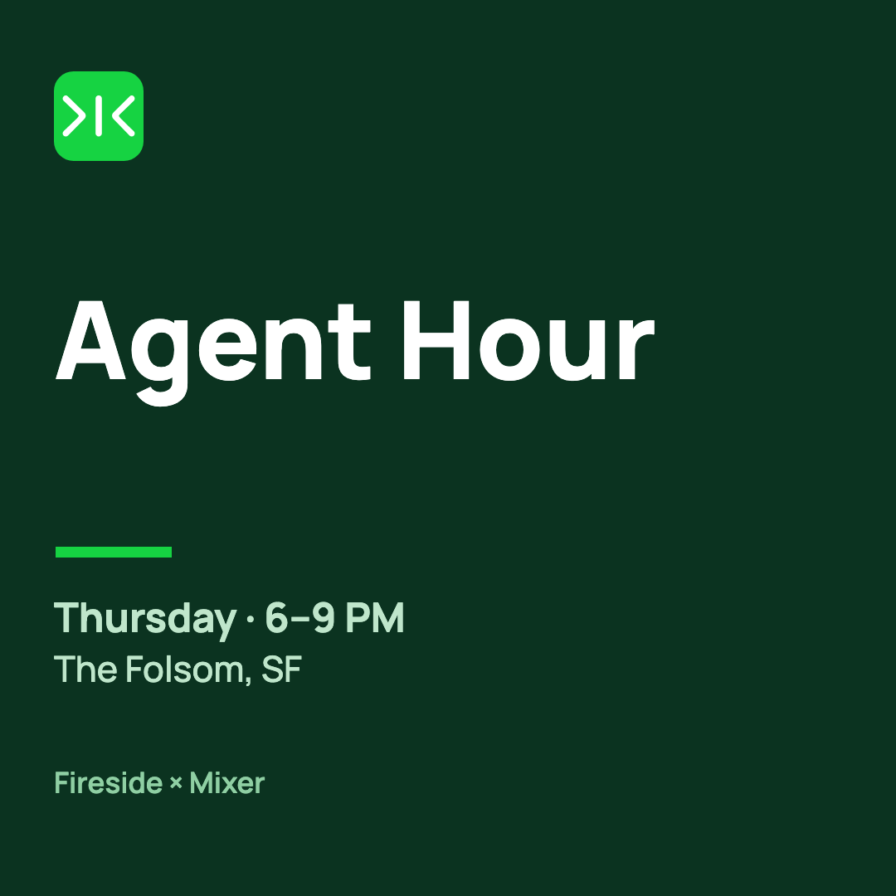
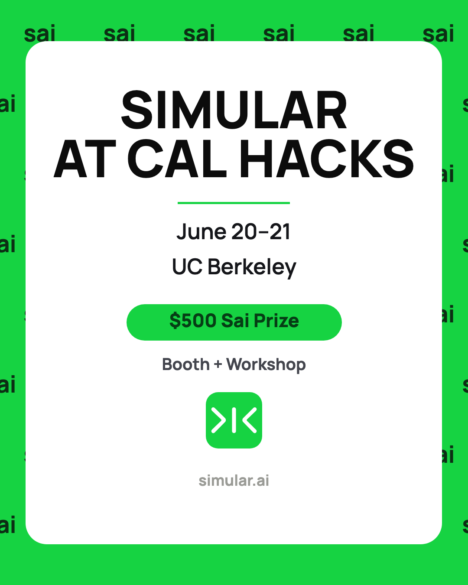
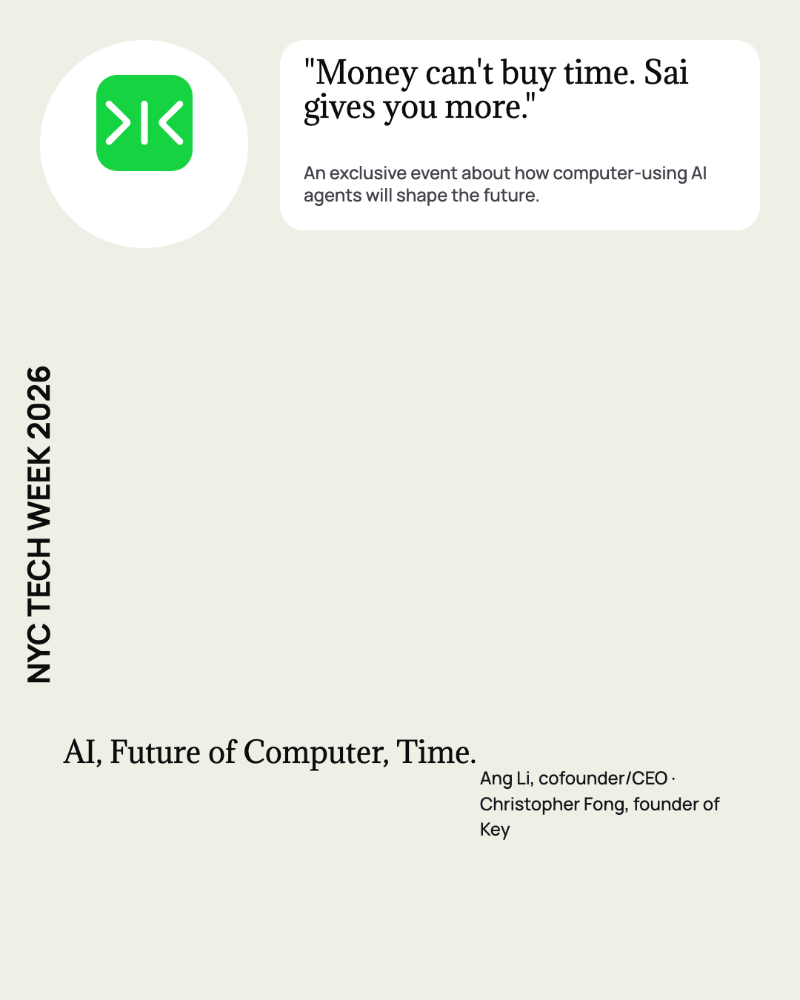

<div align="center">

# Sai Poster Studio

**Turn a line of text into a finished, on-brand Sai poster — in the browser, in seconds.**

A local Vite + React design tool: start from one of 11 Simular-brand templates, drop in your
copy (or a one-line *brief*), and export print-resolution PNG / SVG. It pairs a free-form layout
editor with a high-resolution ASCII-art engine and an automation pipeline that renders posters
from plain text files — no manual design, no clicks.



</div>

---

## What it can do

- **Works as a Claude Skill — no API keys** — describe a poster in plain English and Claude writes the
  brief and renders it. The LLM work is your own Claude session; the app only renders, client-side — so
  there's no key anywhere. See *[Use it as a Claude Skill](#use-it-as-a-claude-skill-no-api-keys)*.
- **11 on-brand templates** — event cards, talk/speaker layouts, benchmark stat sheets, launch
  statements, hackathon posters, editorial features, mixers, and more. Every one is built to the
  Simular brand: Manrope + Adamina type, the signal-green `#16D342`, and the Sai mark.
- **Free-form editor** — type into the Content panel for live updates, or select any element to drag,
  resize, and **rotate** (drag handle, snaps to 15°). **Align-to-canvas** buttons + **snap-to-element
  guides** make alignment exact, and **undo / redo** (⌘/Ctrl+Z · ⌘/Ctrl+Shift+Z) has your back.
- **Every platform size** — Instagram square / portrait, LinkedIn, X. Switch and the layout reflows.
- **Text → poster, automatically** — a tiny Markdown or JSON *brief* auto-picks a template, fills
  it, and renders it. Run one-off, batch a whole folder, watch a folder, or push straight into the
  open editor.
- **High-resolution ASCII art** — a built-in engine renders crisp vector / high-DPI ASCII (8 ramps,
  multiple colour modes). The brand butterfly ships in `public/`.
- **Restyle in place** — decorative **background patterns** (grid / dots / glow), per-word **keyword
  highlighting**, five fonts (Manrope / Inter / Adamina / Instrument / Mono), and per-layer opacity.
- **Print-quality export** — PNG at 2× / 3× / 4× (up to ~4800 px), true-vector SVG, or re-editable JSON.
- **One shared live document** — the editor, the CLI, and `npm run push` all read and write a single
  file, so every browser shows the same poster and a freshly generated poster appears in your open
  editor within ~2 seconds.

---

## Use it as a Claude Skill (no API keys)

This repo **is** a Claude Skill — the `SKILL.md` at the root makes it installable and invocable. There
are **no API keys**: Claude (your own session) turns your text into a brief, and the app renders it in
the browser. Install it into your skills folder:

```bash
git clone git@github.com:wyuee912-ops/sai-poster-studio.git ~/.claude/skills/sai-poster-studio
cd ~/.claude/skills/sai-poster-studio && npm install
```

Then, in Claude Code, just describe a poster:

> **/sai-poster-studio** Day 2 of #SaiCoded — Sai makes editable docs, sheets & slides, saved to your Drive

Claude extracts a brief, pushes it into the studio, and you preview + export at `localhost:5181`.
Anyone you share the repo with gets the **same keyless flow** — *their* Claude is the engine.

---

## Templates



`cal-hacks` · `agent-hour` · `talk-dark` · `editorial-cream` · `ascii-hero` · `benchmark-dark`
· `feature-grid` · `hackathon-dark` · `happy-hour` · `launch` · `enterprise`

Picking a template switches to its native size and **carries your typed text across by slot**, so you
can try the same content in several layouts without retyping. Long headlines auto-shrink to fit —
they never clip.

---

## Made with the Studio

Each poster below was produced by the Studio from a short brief — no manual layout work.

<table>
  <tr>
    <td align="center"><br><sub><b>benchmark-dark</b><br>stat showcase</sub></td>
    <td align="center"><br><sub><b>launch</b><br>campaign / announcement</sub></td>
    <td align="center"><br><sub><b>happy-hour</b><br>mixer / social</sub></td>
  </tr>
  <tr>
    <td align="center"><br><sub><b>talk-dark</b><br>talk / speakers</sub></td>
    <td align="center"><br><sub><b>cal-hacks</b><br>event card</sub></td>
    <td align="center"><br><sub><b>editorial-cream</b><br>editorial feature</sub></td>
  </tr>
</table>

---

## Quick start

```bash
git clone git@github.com:wyuee912-ops/sai-poster-studio.git
cd sai-poster-studio
npm install
npm run dev        # http://localhost:5181
```

---

## Three ways to make a poster

**1. By hand** — open the editor, pick a template, type your copy, nudge things into place, export.

**2. From a brief** — write a short `.md` / `.json` brief, then:

```bash
npm run push briefs/launch.md                       # → appears live in the open editor (~2s)
npm run generate briefs/ --out posters --scale 3    # → high-res PNG files (folder or specific files)
npm run watch                                       # → auto-render anything dropped into briefs/
```

`generate` / `watch` drive the **same renderer** the app uses (via headless Chromium), so output is
identical. SVG instead of PNG: add `--svg`. One-time setup for headless: `npx playwright install chromium`.

**3. From plain English — the Claude Skill** — describe the poster to Claude and it extracts a brief
and pushes it for you. e.g. *"Day 2 of #SaiCoded — Sai makes editable docs, sheets & slides"* → a
finished poster on the canvas. See *[Use it as a Claude Skill](#use-it-as-a-claude-skill-no-api-keys)*
above. No API keys.

---

## The brief format

A brief is the text of a poster. Markdown is the friendly way:

```md
---
type: launch            # optional: event | launch | article — nudges the template
---
# Your wildest idea     ← the H1 is the Title

Eyebrow: Day 1 · #saicoded
Subtitle: The boldest thing you'd try with Sai — what is it?
CTA: Reply with yours
Footer: #trysai · simular.ai
```

`# Heading` → Title · `Key: value` → that field · a key followed by a bullet list joins the bullets
(e.g. `Speakers:`) · front-matter `type` / `template` chooses the layout. Full reference and more
examples: **[`briefs/README.md`](briefs/README.md)** (sample briefs live in [`briefs/`](briefs/)).

---

## Export

| Format | Notes |
|--------|-------|
| **PNG** | 2× / 3× / 4× — text drawn with the real Manrope font, ASCII rendered at full scale (e.g. 1080² → 3240²) |
| **SVG** | true vector — text as `<tspan>`s, shapes and the Sai mark as paths, ASCII embedded high-res |
| **JSON** | the editable poster document — re-open it later with **Import JSON** |

---

## How it works

```
brief (.md/.json) ──▶ auto-pick template ──▶ fill slots ──▶ render (canvas / SVG) ──▶ export
        │                src/poster/auto.js        │
        └──────────────────────────────────────────┴──▶ .studio/current.json  (the live document)
```

The live document is one file (`.studio/current.json`) served by the dev server at `/api/doc`. The
editor loads it on startup, saves edits back, and polls for external changes — which is why
`npm run push` lands in an already-open editor and every browser stays in sync. On a static host
(no server) it falls back to per-browser storage, so a deployed build still works.

### Why the ASCII renders crisp
The source image is sampled at full resolution, mapped to a character ramp, then drawn as vector SVG
text or a high-DPI canvas — never a coarse low-res raster. That's the resolution fix over a naïve
ASCII export.

---

## Project layout

```
sai-poster-studio/
├── SKILL.md                 Claude Skill manifest — clone into ~/.claude/skills/ to install
├── README.md                this file
├── index.html               app entry (Vite mounts src/main.jsx)
├── render.html              headless render harness entry (used by the CLI)
├── vite.config.js           Vite config + the studio-doc-api dev plugin (the /api/doc live-sync)
├── package.json             scripts: dev · build · preview · push · generate · watch
│
├── src/
│   ├── main.jsx             React mount
│   ├── App.jsx              app shell — header, panels, document state, live-sync (load/save/poll),
│   │                        undo/redo + history, keyboard shortcuts, import/export wiring
│   ├── styles.css           global styles + CSS variables (brand tokens)
│   ├── brand.js             brand constants — colours, FONTS map, SIZES, Sai-mark paths, Google Fonts
│   ├── studioSync.js        /api/doc client — fetchDoc / fetchVersion / saveDoc (no-ops with no server)
│   ├── AsciiLab.jsx         the standalone "ASCII lab" tab
│   ├── render.js            headless harness — exposes window.renderPNG / renderSVG / pickTemplate
│   │
│   ├── poster/              ◆ the poster engine
│   │   ├── templates.js     the 11 templates + slot helpers, SLOT_ORDER, buildTemplate, readContent
│   │   ├── auto.js          brief → template routing (autoTemplateId) + briefToContent + posterFromBrief
│   │   ├── parseBrief.js    Markdown / JSON brief parser (DOM-free; used by app + CLI)
│   │   ├── model.js         document model + element factories (text/accent/shape/tile/saiMark/image/ascii)
│   │   ├── Editor.jsx       free-form canvas — drag / resize / rotate, snap-to-element guides, zoom
│   │   ├── Inspector.jsx    right panel — per-element props, align buttons, decor + highlight controls
│   │   ├── LayerList.jsx    the Layers tab — reorder / hide / delete / duplicate
│   │   ├── exportPoster.js  PNG (canvas) + SVG renderers and the export buttons
│   │   ├── decor.js         decorative background patterns (grid / dots / glow) for editor + PNG + SVG
│   │   ├── richtext.js      per-word keyword-highlighting helpers (shared by editor + exporters)
│   │   └── textfit.js       shrink-to-fit font sizing (so display titles never clip)
│   │
│   └── ascii/               ◆ the ASCII-art engine
│       ├── asciiEngine.js   image → ASCII sampling + vector / high-DPI canvas render
│       └── charRamps.js     the 8 character ramps + labels
│
├── scripts/                 ◆ automation (Node; no browser except generate/watch)
│   ├── push.mjs             write a brief into the LIVE studio (.studio/current.json)
│   ├── generate.mjs         headless batch CLI — brief(s) → PNG/SVG via Playwright
│   └── watch.mjs            watch briefs/ and auto-render anything dropped in
│
├── briefs/                  example briefs (*.json, *.md) + briefs/README.md (the format reference)
├── public/                  butterfly.png (brand ASCII art) · favicon.svg
└── docs/                    screenshots + example outputs used by this README

   not in git (see .gitignore): node_modules/ · dist/ · posters/ · .studio/current.json (the live doc)
```

**Where to start reading:** `src/poster/templates.js` (what a poster *is*) → `src/poster/auto.js`
(text → template) → `src/poster/exportPoster.js` (how it's drawn). The engine is the `poster/` and
`ascii/` folders; everything in `scripts/` just drives that same engine headlessly.

---

## Credits / licenses
- ASCII algorithm adapted from **[vietnh1009/ASCII-generator](https://github.com/vietnh1009/ASCII-generator)**
  (MIT) — reimplemented in client-side JS with vector / high-DPI output.
- Layer/inspector editor model inspired by **[openposter/OpenPoster](https://github.com/openposter/OpenPoster)**
  (MIT). This app uses a plain-JSON document, not OpenPoster's Apple `.ca` format.
- Manrope & Adamina (SIL Open Font License). Sai / Simular brand assets © Simular.
